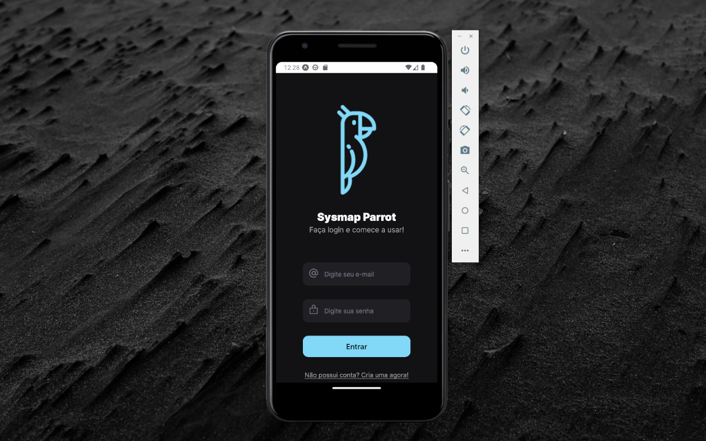

# Parrot Social Network
A social network project developed at the SysMap Excellence Full Stack Trainee Program 2nd edition.

> Status: Developing ⚠️ 




## Modules:

+ [Back-end API](https://github.com/bc-fullstack-02/igor-pestana/tree/main/back-end/rest-api)
+ [Front-end web](https://github.com/bc-fullstack-02/igor-pestana/tree/main/front-end/parrot)
+ [Mobile](https://github.com/bc-fullstack-02/igor-pestana/tree/main/mobile)

## Technologies used:
### Backend API:

<table>
  <tr>
    <td>Node.js</td>
    <td>Express.js</td>
    <td>MongoDB</td>
    <td>Rabbitmq</td>
    <td>Minio</td>
    <td>Docker</td>
  </tr>
  <tr>
    <td>18.12.1</td>
    <td>4.18.2</td>
    <td>latest</td>
    <td>3.11</td>
    <td>latest</td>
    <td>20.10.21</td>
  </tr>
</table>

### Frontend Web:

<table>
  <tr>
    <td>Typescript</td>
    <td>React</td>
    <td>Vite</td>
    <td>Tailwind</td>
  </tr>
  <tr>
    <td>4.6.4</td>
    <td>18.2.0</td>
    <td>3.2.3</td>
    <td>3.2.4</td>
  </tr>
</table>

### Mobile:

<table>
  <tr>
    <td>Typescript</td>
    <td>React Native</td>
  </tr>
  <tr>
    <td> ^4.6.3 </td>
    <td> 0.70.5 </td>
  </tr>
</table>

## How to run the application

clone the project: 
```
git clone https://github.com/igorspestana/parrot-social-network.git
```
### Back-end:
1) go to *parrot-rest-api* directory in *back-end* directory
2) install back-end dependencies:
```
npm install
```
3) start the server and the services:
```
docker-compose up -d
```
*in case of server error, repeat `docker-compose up -d` after the services are successfully running

4) access browser url: 
- Api Swagger Documentation: http://localhost:4000/api-docs/
### Front-end:
1) go to *parrot-web-ui* directory in *front-end* directory
2) install front-end dependencies:
```
npm install
```
3) start the front-end
```
npm run dev
```
4) access browser url: 
- Web Application: http://localhost:5173
### Mobile:

1) go to *parrot-app-mobile* directory in *mobile* directory
2) install mobile dependencies:
```
npm install
```
3) start the mobile
```
npx expo start
```

## Author

- [@igorspestana](https://github.com/igorspestana)


## Links
[](https://www.linkedin.com/in/igorspestana/)


## License

[](https://choosealicense.com/licenses/mit/)

Free Software, Hell Yeah!
